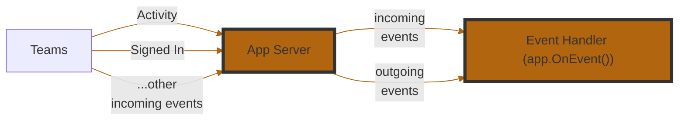
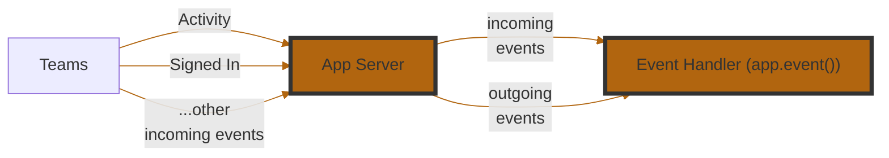

# Listening To Events

An **event** is a foundational concept in building agents — it represents something noteworthy happening either on Microsoft Teams or within your application. These events can originate from the user (e.g. installing or uninstalling your app, sending a message, submitting a form), or from your application server (e.g. startup, error in a handler).


::: zone pivot="csharp"

::: zone-end

::: zone pivot="python,typescript"

::: zone-end


The Teams SDK makes it easy to subscribe to these events and respond appropriately. You can register event handlers to take custom actions when specific events occur — such as logging errors, triggering workflows, or sending follow-up messages.

Here are the events that you can start building handlers for:


::: zone pivot="csharp,typescript"
| **Event Name**      | **Description**                                                                |
| ------------------- | ------------------------------------------------------------------------------ |
| `start`             | Triggered when your application starts. Useful for setup or boot-time logging. |
| `signin`            | Triggered during a sign-in flow via Teams.                                     |
| `error`             | Triggered when an unhandled error occurs in your app. Great for diagnostics.   |
| `activity`          | A catch-all for incoming Teams activities (messages, commands, etc.).          |
| `activity.response` | Triggered when your app sends a response to an activity. Useful for logging.   |
| `activity.sent`     | Triggered when an activity is sent (not necessarily in response).              |
::: zone-end

::: zone pivot="python"
| **Event Name**      | **Description**                                                                |
| ------------------- | ------------------------------------------------------------------------------ |
| `start`             | Triggered when your application starts. Useful for setup or boot-time logging. |
| `sign_in`           | Triggered during a sign-in flow via Teams.                                     |
| `error`             | Triggered when an unhandled error occurs in your app. Great for diagnostics.   |
| `activity`          | Triggered for all incoming Teams activities (messages, commands, etc.).        |
| `activity_response` | Triggered when your app sends a response to an activity. Useful for logging.   |
| `activity_sent`     | Triggered when an activity is sent (not necessarily in response).              |

<br/>
:::info
Event handler registration uses `@app.event("<event_name>")` with an async function that receives an event object specific to the event type (e.g., `ErrorEvent`, `ActivityEvent`).
:::
::: zone-end


### Example 1

We can subscribe to errors that occur in the app.


::: zone pivot="csharp"
```csharp
app.OnError((sender, @event) =>
{
    // do something with the error
    app.Logger.Info(@event.Exception.ToString());
});
```
::: zone-end

::: zone pivot="python"
```python
@app.event("error")
async def handle_error(event: ErrorEvent):
    """Handle error events."""
    print(f"Error occurred: {event.error}")
    if hasattr(event, "context") and event.context:
        print(f"Context: {event.context}")
```
::: zone-end

::: zone pivot="typescript"
```typescript
app.event('error', ({ error }) => {
  app.log.error(error);
  // Or Alternatively, send it to an observability platform
});
```
::: zone-end


### Example 2


::: zone pivot="csharp"
When an activity is received, log its `JSON` payload.

```csharp
app.OnActivity((sender, @event) =>
{
    app.Logger.Info(@event.Activity.ToString());
});
```
::: zone-end

::: zone pivot="python"
When an activity is received, log its payload.

```python
@app.event("activity")
async def handle_activity(event: ActivityEvent):
    """Handle activity events."""
    print(f"Activity received: {event.activity}")
```
::: zone-end

::: zone pivot="typescript"
When a user signs in using `OAuth` or `SSO`, use the graph api to fetch their profile and say hello.

```typescript
import * as endpoints from '@microsoft/teams.graph-endpoints';

app.event('signin', async ({ activity, send, userGraph }) => {
  const me = await userGraph.call(endpoints.me.get);
  await send(`👋 Hello ${me.name}`);
});
```
::: zone-end

