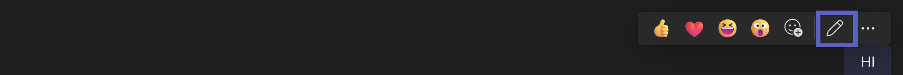

# Activity: Message Update

```
    app.on('messageUpdate', async ({ activity }) > {});
```

Message update activities represent an update of an existing message activity within a conversation. The updated activity is referred to by the `id` and `conversation` fields within the activity, and the message update activity contains all fields in the revised message activity.

## Schema

Message update activities are identified by a `type` value of `messageUpdate`.

`A5900`: Channels MAY elect to send messageUpdate activities for all updates within a conversation, a subset of updates within a conversation (e.g. only updates by certain users), or no activities within the conversation.

`A5901`: If a bot triggers an update, the channel SHOULD NOT send a message update activity back to that bot.

`A5902`: Channels SHOULD NOT send message update activities corresponding to activities whose type is not `message`.

## Message update UI in Teams

To update a message in Teams, you can hover over the message in the client and click the pencil icon. This will open a text editor where you can update the message.



To save the changes, click the checkmark icon or to cancel, click the X icon.

## Resources

* [Microsoft Teams: Message Update](/microsoftteams/platform/bots/build-conversational-capability#receive-edit-message-activity)