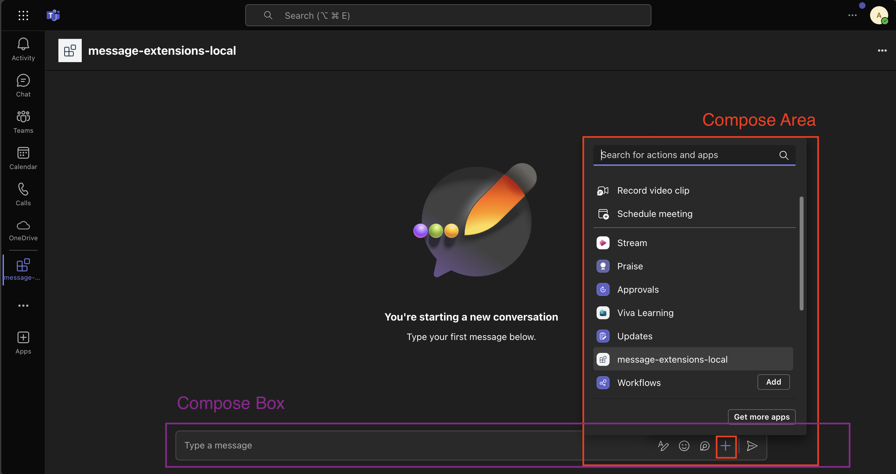
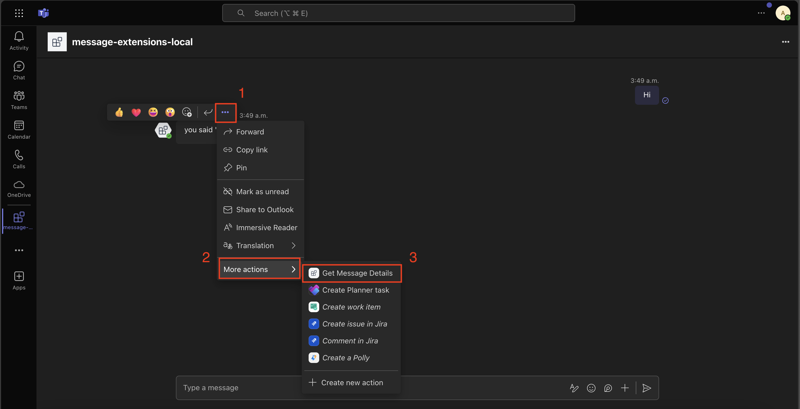
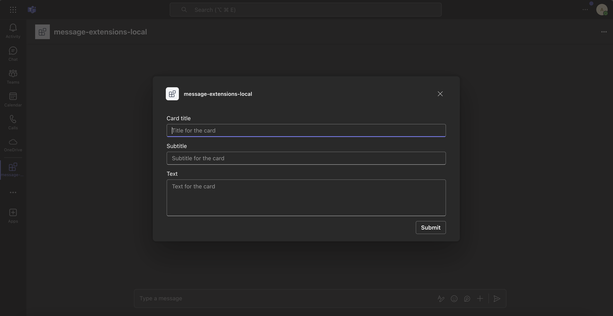
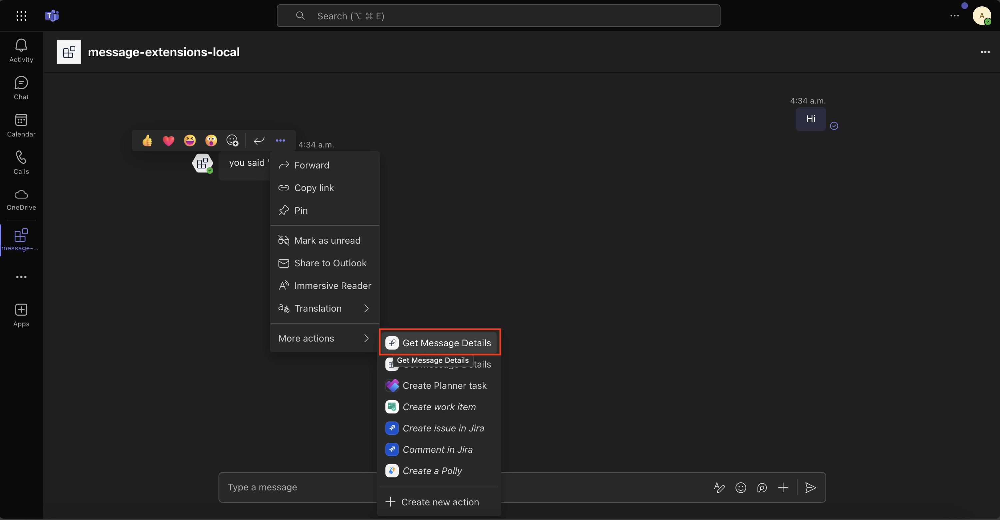
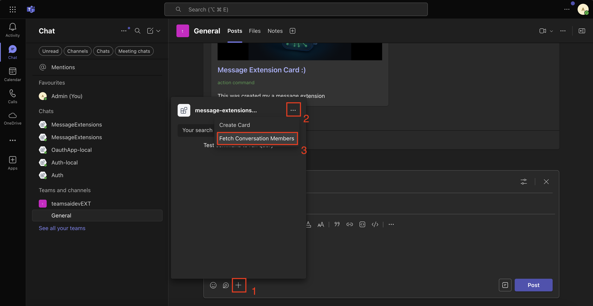

# Action commands (preview)

[This article is prerelease documentation and is subject to change.]

Action commands allow you to present your users with a modal pop-up called a dialog in Teams. The dialog collects or displays information, processes the interaction, and sends the information back to Teams compose box.

## Action command invocation locations

There are three different areas action commands can be invoked from:

1. Compose Area
2. Compose Box
3. Message

### Compose Area and Box



### Message action command



> [!tip]
> See the [Invoke Locations](/messaging-extensions/how-to/action-commands/define-action-command?tabs=Teams-toolkit%2Cdotnet#select-action-command-invoke-locations) guide to learn more about the different entry points for action commands.

## Setting up your Teams app manifest

To use action commands you have define them in the Teams app manifest. Here is an example:

```json
"composeExtensions": [
    {
        "botId": "${{BOT_ID}}",
        "commands": [
            {
            "id": "createCard",
            "type": "action",
            "context": [
                "compose",
                "commandBox"
            ],
            "description": "Command to run action to create a card from the compose box.",
            "title": "Create Card",
            "parameters": [
                {
                    "name": "title",
                    "title": "Card title",
                    "description": "Title for the card",
                    "inputType": "text"
                },
                {
                    "name": "subTitle",
                    "title": "Subtitle",
                    "description": "Subtitle for the card",
                    "inputType": "text"
                },
                {
                    "name": "text",
                    "title": "Text",
                    "description": "Text for the card",
                    "inputType": "textarea"
                }
            ]
            },
            {
                "id": "getMessageDetails",
                "type": "action",
                "context": [
                    "message"
                ],
                "description": "Command to run action on message context.",
                "title": "Get Message Details"
            },
            {
                "id": "fetchConversationMembers",
                "description": "Fetch the conversation members",
                "title": "Fetch Conversation Members",
                "type": "action",
                "fetchTask": true,
                "context": [
                    "compose"
                ]
            },
        ]
    }
]
```

Here we are defining three different commands:

1. `createCard` - that can be invoked from either the `compose` or `commandBox` areas. Upon invocation a dialog will popup asking the user to fill the `title`, `subTitle`, and `text`.



2. `getMessageDetails` - It is invoked from the `message` overflow menu. Upon invocation the message payload will be sent to the app which will then return the details like `createdDate`...etc.



3. `fetchConversationMembers` - It is invoked from the `compose` area. Upon invocation the app will return an adaptive card in the form of a dialog with the conversation roster.



## Handle submission

Handle submission when the `createCard` or `getMessageDetails` actions commands are invoked.

```typescript
app.on('message.ext.submit', async ({ activity }) => {
  const { commandId } = activity.value;
  let card: ICard;

  if (commandId === 'createCard') {
    // activity.value.commandContext == "compose"
    card = createCard(activity.value.data);
  } else if (commandId === 'getMessageDetails' && activity.value.messagePayload) {
    // activity.value.commandContext == "message"
    card = createMessageDetailsCard(activity.value.messagePayload);
  } else {
    throw new Error(`Unknown commandId: ${commandId}`);
  }

  return {
    composeExtension: {
      type: 'result',
      attachmentLayout: 'list',
      attachments: [cardAttachment('adaptive', card)],
    },
  };
});

```

`createCard()` function

```typescript
interface FormData {
  title: string;
  subtitle: string;
  text: string;
}

export function createCard(data: FormData) {
  return new Card(
    new Image(IMAGE_URL),
    new TextBlock(data.title, {
      size: 'large',
      weight: 'bolder',
      color: 'accent',
      style: 'heading',
    }),
    new TextBlock(data.subtitle, {
      size: 'small',
      weight: 'lighter',
      color: 'good',
    }),
    new TextBlock(data.text, {
      wrap: true,
      spacing: 'medium',
    })
  );
}

```

`createMessageDetailsCard()` function

```typescript
export function createMessageDetailsCard(messagePayload: Message) {
  const cardElements: Element[] = [
    new TextBlock('Message Details', {
      size: 'large',
      weight: 'bolder',
      color: 'accent',
      style: 'heading',
    }),
  ];

  if (messagePayload?.body?.content) {
    cardElements.push(
      new TextBlock('Content', {
        size: 'medium',
        weight: 'bolder',
        spacing: 'medium',
      }),
      new TextBlock(messagePayload.body.content)
    );
  }

  if (messagePayload?.attachments?.length) {
    cardElements.push(
      new TextBlock('Attachments', {
        size: 'medium',
        weight: 'bolder',
        spacing: 'medium',
      }),
      new TextBlock(`Number of attachments: ${messagePayload.attachments.length}`, {
        wrap: true,
        spacing: 'small',
      })
    );
  }

  if (messagePayload?.createdDateTime) {
    cardElements.push(
      new TextBlock('Created Date', {
        size: 'medium',
        weight: 'bolder',
        spacing: 'medium',
      }),
      new TextBlock(messagePayload.createdDateTime, {
        wrap: true,
        spacing: 'small',
      })
    );
  }

  if (messagePayload?.linkToMessage) {
    cardElements.push(
      new TextBlock('Message Link', {
        size: 'medium',
        weight: 'bolder',
        spacing: 'medium',
      }),
      new ActionSet(
        new OpenUrlAction(messagePayload.linkToMessage, {
          title: 'Go to message',
        })
      )
    );
  }

  return new Card(...cardElements);
}

```

## Handle opening adaptive card dialog

Handle opening adaptive card dialog when the `fetchConversationMembers` command is invoked.

```typescript
app.on('message.ext.open', async ({ activity, api }) => {
  const conversationId = activity.conversation.id;
  const members = await api.conversations.members(conversationId).get();
  const card = createConversationMembersCard(members);

  return {
    task: {
      type: 'continue',
      value: {
        title: 'Conversation members',
        height: 'small',
        width: 'small',
        card: cardAttachment('adaptive', card),
      },
    },
  };
});

```

`createConversationMembersCard()` function

```typescript
export function createConversationMembersCard(members: Account[]) {
  const membersList = members.map((member) => member.name).join(', ');

  return new Card(
    new TextBlock('Conversation members', {
      size: 'medium',
      weight: 'bolder',
      color: 'accent',
      style: 'heading',
    }),
    new TextBlock(membersList, {
      wrap: true,
      spacing: 'small',
    })
  );
}

```

## Resources

[Action commands](/messaging-extensions/how-to/action-commands/define-action-command?tabs=Teams-toolkit%2Cdotnet)