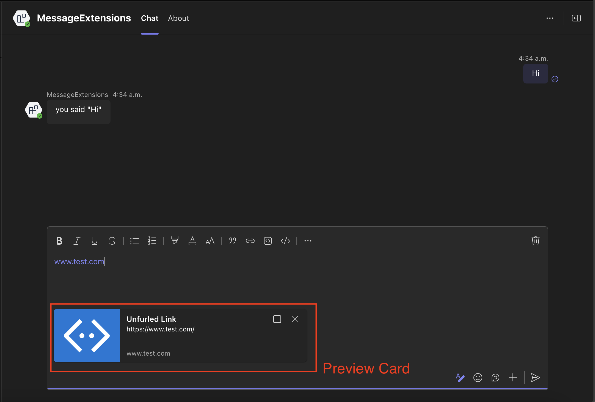
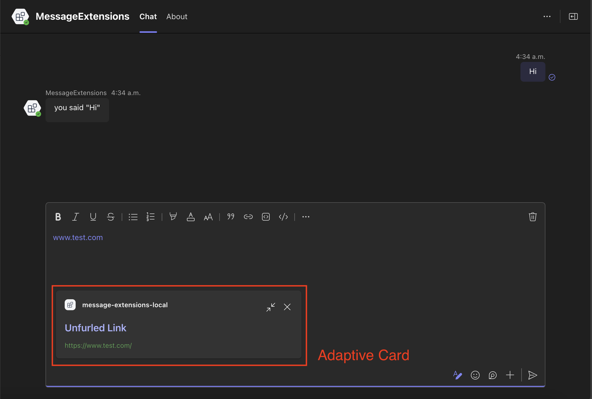

# Link unfurling (preview)

[This article is prerelease documentation and is subject to change.]

Link unfurling lets your app respond when users paste URLs into Teams. When a URL from your registered domain is pasted, your app receives the URL and can return a card with additional information or actions. This works like a search command where the URL acts as the search term. Users can use link unfurling without installing your app.

## Setting up your Teams app manifest

<!-- langtabs-start -->
```json
"composeExtensions": [
    {
        "botId": "${{BOT_ID}}",
        "messageHandlers": [
            {
                "type": "link",
                "value": {
                    "domains": [
                        "www.test.com"
                    ]
                }
            }
        ]
    }
]
```
<!-- langtabs-end -->

When a user pastes a URL from your registered domain (like `www.test.com`) into the Teams compose box, your app will receive a notification. Your app can then respond by returning an adaptive card that displays a preview of the linked content. This preview card appears before the user sends their message in the compose box, allowing them to see how the link will be displayed to others.


## Handle link unfurling

Handle link unfurling when a URL from your registered domain is submited into the Teams compose box.

<!-- langtabs-start -->
```typescript
app.on('message.ext.query-link', async ({ activity }) => {
  const { url } = activity.value;

  if (!url) {
    return { status: 400 };
  }

  const { card, thumbnail } = createLinkUnfurlCard(url);
  const attachment = {
    ...cardAttachment('adaptive', card), // expanded card in the compose box...
    preview: cardAttachment('thumbnail', thumbnail), //preview card in the compose box...
  };

  return {
    composeExtension: {
      type: 'result',
      attachmentLayout: 'list',
      attachments: [attachment],
    },
  };
});
```
<!-- langtabs-end -->

`createLinkUnfurlCard()` function

<!-- langtabs-start -->
```typescript
export function createLinkUnfurlCard(url: string) {
  const thumbnail = {
    title: 'Unfurled Link',
    text: url,
    images: [
      {
        url: IMAGE_URL,
      },
    ],
  } as ThumbnailCard;

  const card = new Card(
    new TextBlock('Unfurled Link', {
      size: 'large',
      weight: 'bolder',
      color: 'accent',
      style: 'heading',
    }),
    new TextBlock(url, {
      size: 'small',
      weight: 'lighter',
      color: 'good',
    })
  );

  return {
    card,
    thumbnail,
  };
}
```
<!-- langtabs-end -->

The link unfurling response includes both a full adaptive card and a preview card. The preview card appears in the compose box when a user pastes a URL:



The user can expand the preview card by clicking on the _expand_ button on the top right.



The user can then choose to send entire the preview or the full adaptive card as a message.

## Resources

- [Link unfurling](/microsoftteams/platform/messaging-extensions/how-to/link-unfurling?tabs=desktop%2Cjson%2Cadvantages)