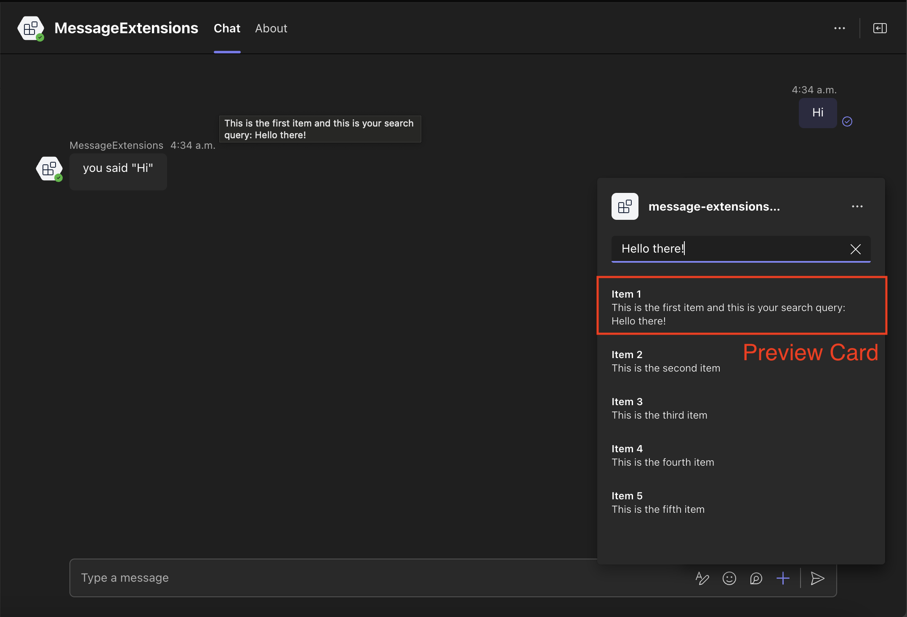
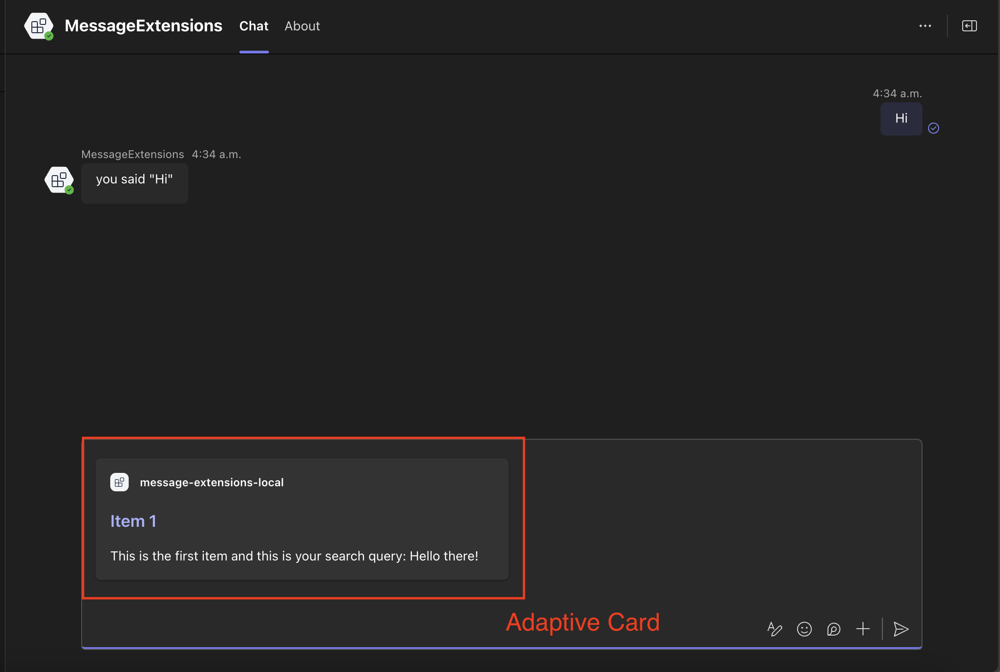

# Search commands (preview)

[This article is prerelease documentation and is subject to change.]

Message extension search commands allow users to search external systems and insert the results of that search into a message in the form of a card.

## Search command invocation locations

There are three different areas search commands can be invoked from:

1. Compose Area
2. Compose Box

### Compose Area and Box


## Setting up your Teams app manifest

To use search commands you have define them in the Teams app manifest. Here is an example:

<!-- langtabs-start -->
```json
"composeExtensions": [
    {
        "botId": "${{BOT_ID}}",
        "commands": [
            {
                "id": "searchQuery",
                "context": [
                    "compose",
                    "commandBox"
                ],
                "description": "Test command to run query",
                "title": "Search query",
                "type": "query",
                "parameters": [
                    {
                        "name": "searchQuery",
                        "title": "Search Query",
                        "description": "Your search query",
                        "inputType": "text"
                    }
                ]
            }
        ]
    }
]
```
<!-- langtabs-end -->

Here we are defining the `searchQuery` search (or query) command.

## Handle submission

Handle opening adaptive card dialog when the `searchQuery` query is submitted.

<!-- langtabs-start -->
```typescript
app.on('message.ext.query', async ({ activity }) => {
  const { commandId } = activity.value;
  const searchQuery = activity.value.parameters![0].value;

  if (commandId == 'searchQuery') {
    const cards = await createDummyCards(searchQuery);
    const attachments = cards.map(({ card, thumbnail }) => {
      return {
        ...cardAttachment('adaptive', card), // expanded card in the compose box...
        preview: cardAttachment('thumbnail', thumbnail), // preview card in the compose box...
      };
    });

    return {
      composeExtension: {
        type: 'result',
        attachmentLayout: 'list',
        attachments: attachments,
      },
    };
  }

  return { status: 400 };
});
```
<!-- langtabs-end -->

`createDummyCards()` function

<!-- langtabs-start -->
```typescript
export async function createDummyCards(searchQuery: string) {
  const dummyItems = [
    {
      title: 'Item 1',
      description: `This is the first item and this is your search query: ${searchQuery}`,
    },
    { title: 'Item 2', description: 'This is the second item' },
    { title: 'Item 3', description: 'This is the third item' },
    { title: 'Item 4', description: 'This is the fourth item' },
    { title: 'Item 5', description: 'This is the fifth item' },
  ];

  const cards = dummyItems.map((item) => {
    return {
      card: new Card(
        new TextBlock(item.title, {
          size: 'large',
          weight: 'bolder',
          color: 'accent',
          style: 'heading',
        }),
        new TextBlock(item.description, {
          wrap: true,
          spacing: 'medium',
        })
      ),
      thumbnail: {
        title: item.title,
        text: item.description,
      } as ThumbnailCard,
    };
  });

  return cards;
}
```
<!-- langtabs-end -->

The search results include both a full adaptive card and a preview card. The preview card appears as a list item in the search command area:



When a user clicks on a list item the dummy adaptive card is added to the compose box:



## Resources

- [Search command](https://learn.microsoft.com/en-us/microsoftteams/platform/messaging-extensions/how-to/search-commands/define-search-command?tabs=Teams-toolkit%2Cdotnet)