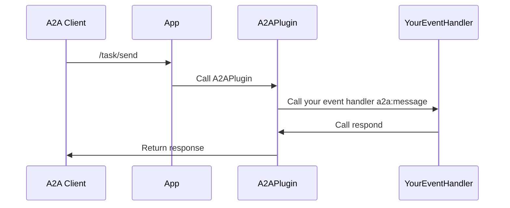

# A2A Server (preview) (TypeScript)

[This article is prerelease documentation and is subject to change.]

## What is an A2A Server?
An A2A server is an agent that exposes its capabilities to other agents using the A2A protocol. With this package, you can make your Teams app accessible to A2A clients.

## Adding the A2APlugin

To enable A2A server functionality, add the `A2APlugin` to your Teams app and provide an `agentCard`:

```ts
// import { A2APlugin, schema } from "@microsoft/teams.a2a";
// import { App } from "@microsoft/teams.apps";
const agentCard: schema.AgentCard = {
    name: 'Weather Agent',
    description: 'An agent that can tell you the weather',
    url: `http://localhost:${PORT}/a2a`,
    provider: {
        organization: 'Weather Co.',
    },
    version: '0.0.1',
    capabilities: {},
    skills: [
        {
            // Expose various skills that this agent can perform
            id: 'get_weather',
            name: 'Get Weather',
            description: 'Get the weather for a given location',
            tags: ['weather', 'get', 'location'],
            examples: [
                // Give concrete examples on how to contact the agent
                'Get the weather for London',
                'What is the weather',
                'What\'s the weather in Tokyo?',
                'How is the current temperature in San Francisco?',
            ],
        },
    ],
};

const app = new App({
    logger,
    plugins: [new A2APlugin({
        agentCard
    })],
});
```

## Agent Card Exposure

The plugin automatically exposes your agent card at the path `/.well-known/agent.json`.

## Handling A2A Requests

Handle incoming A2A requests by adding an event handler for the `a2a:message` event. You may use `accumulateArtifacts` to iteratively accumulate artifacts for the task, or simply `respond` with the final result.

```ts
app.event('a2a:message', async ({ respond, taskContext }) => {
    logger.info(`Received message: ${taskContext.userMessage}`);
    const textInput = taskContext.userMessage.parts.filter(p => p.type === 'text').at(0)?.text;
    if (!textInput) {
        await respond({
            'state': 'failed',
            'parts': [
                {
                    type: 'text',
                    text: 'My agent currently only supports text input'
                }
            ]
        });
        return;
    }
    const result: string | TaskUpdate = await myEventHandler(textInput);
    await respond(result);
});
```

> [!NOTE]
> -   You must have only a single handler that calls `respond`.
> -   You **must** call `respond` as the last step in your handler. This resolves the open request to the caller.

## Sequence Diagram



## Further Reading

-   [A2A Protocol](https://a2a-protocol.org/) 